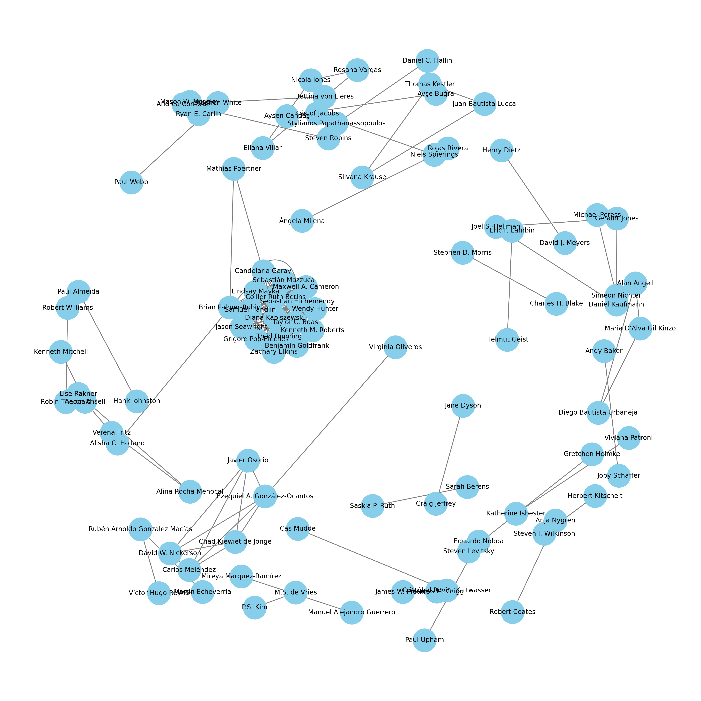
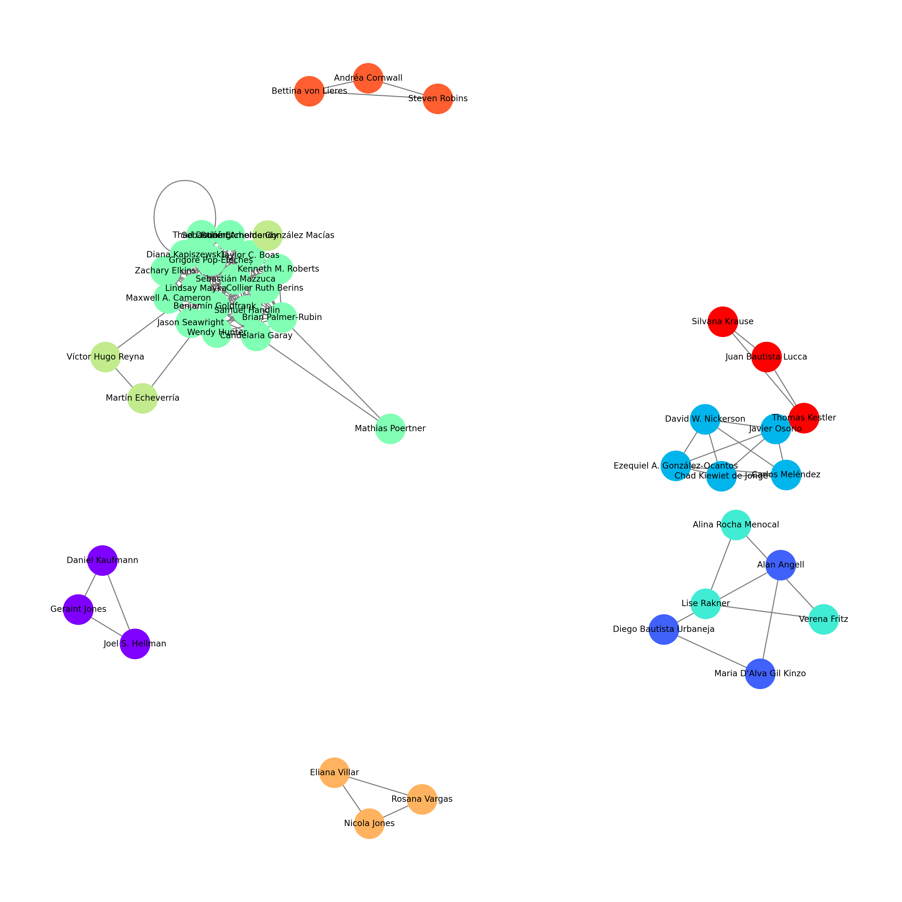
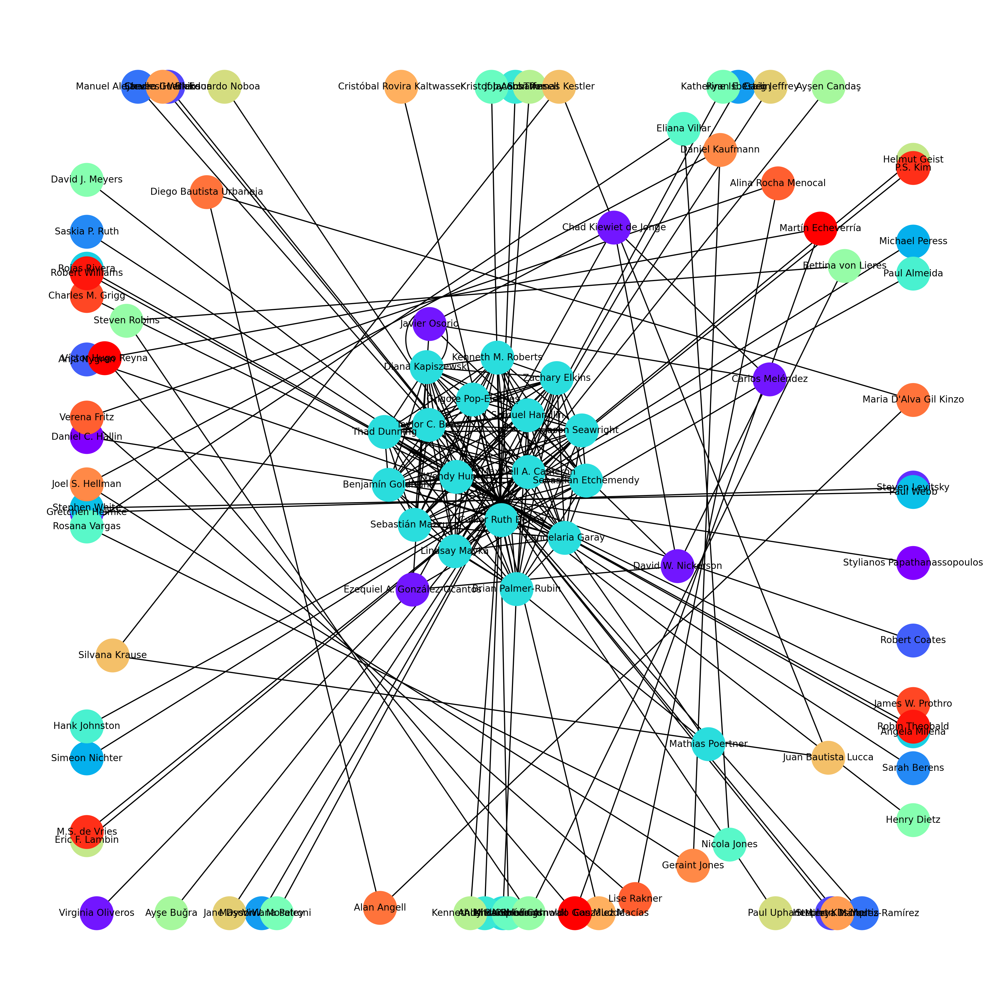
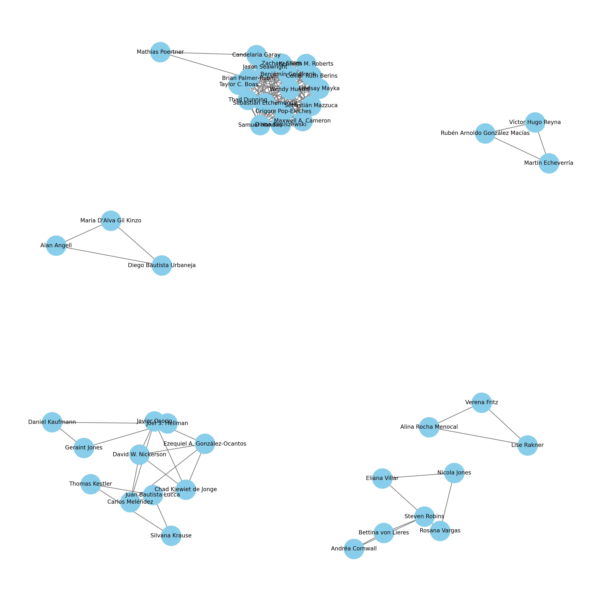

# Network analysis of authors on Clientelism and political power in Latin America

Este proyecto contiene un análisis de redes basado en autores que investigan sobre clientelismo y poder político en América Latina.

## Visualizaciones de la red

### Red de Coautorías Completa

### Comunidades Detectadas en la Red

### Componentes Conectados

### Red Filtrada por Coautorías

---
